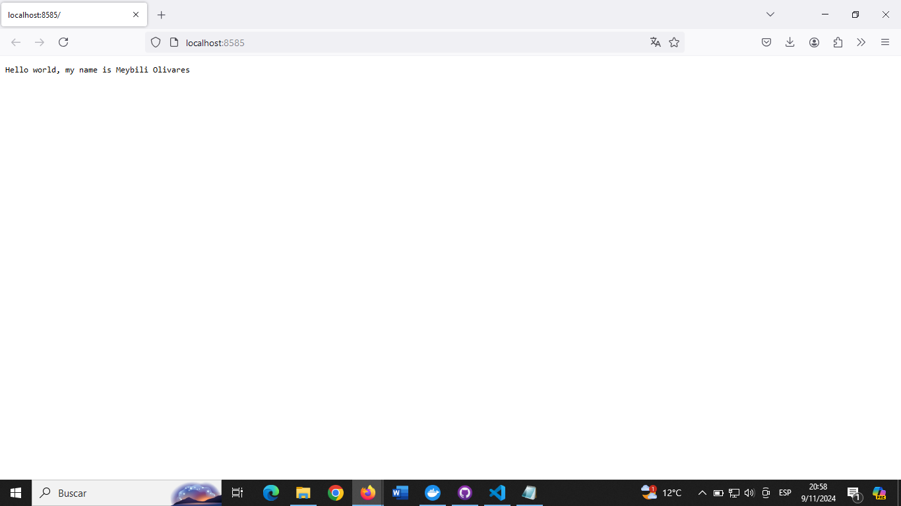

# Go Project: exercise4go

This project is a simple Go application containerized with Docker for deployment.

## Project Structure

- `main.go`: The main entry point of the Go application, containing the Go code to run the program.
- `go.mod`: Defines the module and dependencies for the Go project.
- `Dockerfile`: Defines how the Docker image is built for the Go project.
- `README.md`: Project documentation and instructions for execution.

## Prerequisites

Before running this project, you must have the following programs:

- **Go**: To build and run the Go application. You can download Go from [Go Downloads](https://go.dev/dl/).
- **Docker**: To build and run the container. You can download Docker from [Docker Desktop](https://www.docker.com/products/docker-desktop).
- **Docker Hub Account**: To pull the project image directly from Docker Hub. Make sure you have an account and are logged in.

## Manual Execution from Code

1. **Download the Project from GitHub**:

   - Go to the repository on GitHub and click **"Code"**. Then select **"Download ZIP"** to download the project to your computer.
   - Unzip the ZIP file into a folder of your choice.

2. **Open a Terminal in the Project Folder**:

   - Navigate to the folder where you unzipped the project and go into the `exercise4go` project folder.
   - Open a terminal or command prompt (CMD) inside this folder. On Windows, you can right-click the folder and select **"Open PowerShell window here"**.

3. **Build the Go Application**:

     Run the following command in the terminal to build the Docker image:
        docker build -t mi/exercise4go .

4. **Run the Application**:

    Once the image has been built successfully, run the following command to start the container:
        docker run --name exercise4go   -p 8585:8585 meybili/exercise4go

## Running from Docker Hub

1. **Pull the image from Docker Hub**:

     docker pull meybili/exercise4go:latest

2. **Run the container for the project**:

        docker run --name exercise4go -p 8585:8585 meybili/exercise4go

3. **Open your browser and navigate to http://localhost:8585 to see the app.**

### Output Example

### Notes

- Make sure Docker is running.
- If you have problems accessing http://localhost:8585, check that the port is not in use or check your firewall.

## Credits

This project was developed by Meybili Olivares (https://github.com/meybili19).